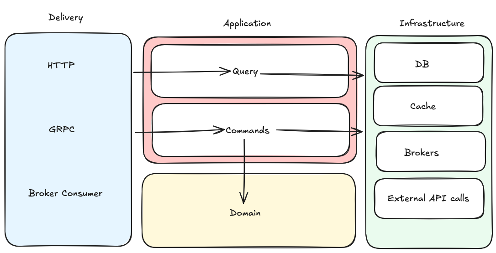

# DDD CQRS Proto-first Layout

This project demonstrates a **Domain-Driven Design (DDD)** approach with **CQRS (Command Query Responsibility Segregation)** in a Go application. It provides a clear separation between commands and queries, as well as modular architecture for delivery, application, domain, and infrastructure layers.

## Architecture Overview

* **Delivery Layer:** Handles communication with the outside world (HTTP, gRPC, message brokers).
* **Application Layer:** Processes Commands and Queries. Orchestrates domain logic without directly depending on infrastructure.
* **Domain Layer:** Contains core business logic and entities.
* **Infrastructure Layer:** Handles database, caching, messaging, and external API integrations (outgoing HTTP, gRPC calls and e.t.c.).



## Knowledge:

### Proto code style

- https://buf.build/docs/best-practices/style-guide/ - how to create buf modules and to work with them
- https://protobuf.dev/best-practices/1-1-1/ - protofuf code style
- https://github.com/googleapis/googleapis/blob/master/google/api/http.proto - grpc-gateway handler annotations
- https://buf.build/bufbuild/protovalidate/docs/main:buf.validate - proto fields validator
- https://buf.build/grpc-ecosystem/grpc-gateway/docs/main:grpc.gateway.protoc_gen_openapiv2.options - swagger by proto options

### Code style and linting:

- https://github.com/sau00/uber-go-guide-ru/blob/master/style.md - uber code style
- https://gist.github.com/maratori/47a4d00457a92aa426dbd48a18776322 - linter for code style maintenance

### Layout

- https://learn.microsoft.com/en-us/azure/architecture/patterns/cqrs - cqrs explanation
- https://habr.com/ru/companies/oleg-bunin/articles/791420/ - ddd article

## Prerequisites

```shell
brew install golangci-lint
brew install pre-commit
pre-commit install -c pre-commit.yaml
```

```shell
go install github.com/not-for-prod/implgen@latest
go install github.com/not-for-prod/clay/cmd/protoc-gen-goclay@latest
go install github.com/matryer/moq@latest
go install github.com/pressly/goose/v3/cmd/goose@latest
```

- `implgen` - simple interface-based stub file generator
- `protoc-gen-goclay` - protobuf plugin supported by `github.com/not-for-prod/clay`
- `moq` - mock stubs generator
- `goose` - migration tool
